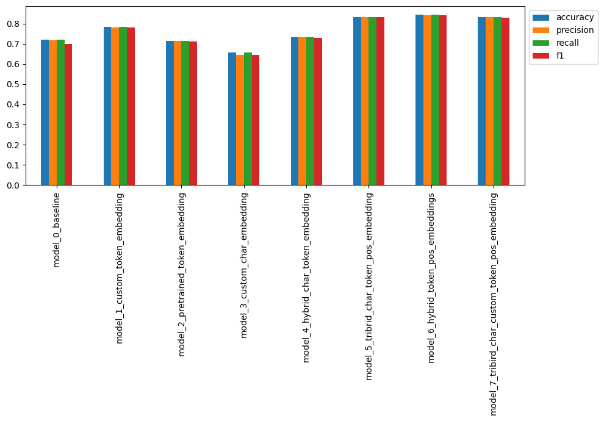

<h1 align="center">SkimLit Abstract Simpilifier📄⚡</h1>
<h3 align="center">Skim through Abstracts faster than ever..</h3>

<div align="center" id="top">
  
</div>
  
##  About ##
This NLP app automatically classifies each sentence into a relevant heading (e.g. objective, methods, results, etc..), so you can quickly skim through abstracts and find the information you need. This project is inspired by the 2017 paper [PubMed 200k RCT: a Dataset for Sequential Sentence Classification in Medical Abstracts](https://arxiv.org/abs/1710.06071).


##  Model Experiments ##
to see the model experiments: All the notebooks are available [here]("https://github.com/ronysalem/Skimlit-Abstract-Simpilifier/Notebooks").
The table below summarizes some of the model experiments tried :
| Model  | Accuracy |
|---|---|
| NaiveBiase Model "Baseline"| 72% |
| Tribrid model "Universal Sentence Encoder, character embeddings, positional embeddings" | 83% |
| Bert Tribrid model "PUBMED BERT, character embeddings, positional embeddings" | 88% |

##Expriments Results##
**Without using Bert Pubmed embeddings**


**With Bert Pubmed embeddings** 


##Best Performing model architecture:## 


## How to run the app in Colab: ##
1. go to [here]("https://github.com/ronysalem/Skimlit-Abstract-Simpilifier/Notebooks") and download Running_in_colab Notebook
2. upload it to Colab
3. Run the cells
4. After running the cell ``` ! streamlit run app.py & npx localtunnel --port 8501 ``` you will see output like this : 
5. copy the External IP from the External URl in this image it was : 34.125.226.87 you will have a different one when running the code
6. click on the URL next to **your url is:** you will be directed to this page : 
7. paste the External IP into tunnel password then click on **Click to submit** button so that the Streamlit app will be initialized to be tested out.


